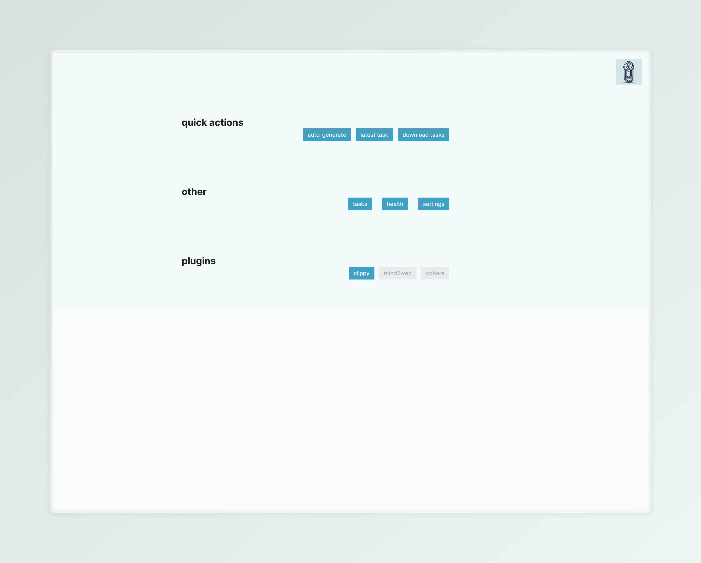

# web-agent-collection-offline-dataset

Originally from [clippy](https://github.com/grahamannett/clippy)

This is the refactored version of the original web annotation tool and clippy integration



# To use

# Plugins

The way you integrate datasets/agents is now via a plugin system.  An example can be seen in `src/wac_lab/plugins/clippy.py` that uses a websocket to communicate with the clippy agent.


# Example Dataset

The full dataset will be available on huggingface, to use a small example until then use the following [tasks-examples.zip](https://github.com/user-attachments/files/16169267/tasks-examples.zip)

Example usage:
```bash
# assuming you are in the wac-agent-collection-offline-dataset directory
wget https://github.com/user-attachments/files/16169267/tasks-examples.zip && unzip tasks-examples.zip
mkdir -p data && mv tasks-examples data/tasks

DATA_DIR=$PWD/data pdm run app
```